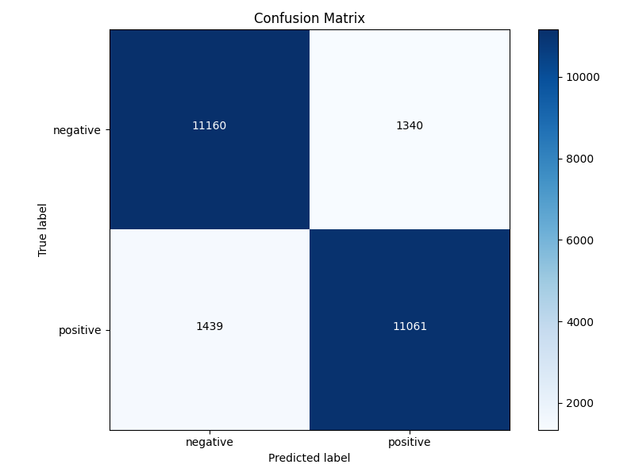

# 🎬 BERT Sentiment Analysis

> Fine-tuned BERT on IMDB Movie Reviews for binary sentiment classification (positive/negative), deployed as an interactive Streamlit web app.

## 🧠 Model Details
- Base model: bert-base-uncased
- Dataset: IMDB Movie Reviews (HuggingFace datasets)
- Task: Binary Sentiment Classification (Positive / Negative)
- Fine-tuned for 3 epochs using HuggingFace Trainer API
- Training time: ~18 minutes (GPU)

## 🛠️ Tech Stack
- Python, PyTorch, HuggingFace Transformers
- HuggingFace Datasets, Scikit-learn
- Streamlit (frontend)

## 📁 Project Structure
```text
.
├── .gitignore
├── app.py
├── check_setup.py
├── predict.py
├── requirements.txt
├── run_app.bat
├── run_train.bat
└── train.py
```

## 🚀 Setup & Usage
1. Create and activate venv
2. `pip install -r requirements.txt`
3. `python check_setup.py`
4. `python train.py`
5. `streamlit run app.py`

## 📊 Results
| Metric | Score |
|--------|-------|
| Accuracy | 88.88% |
| F1 Score | 0.89 |
| Precision | 0.89 |
| Recall | 0.89 |

Evaluated on 25,000 IMDB test samples. Equal performance across both classes (negative/positive) confirms no class bias.

### Confusion Matrix


## ✨ Features
- Real-time sentiment prediction with confidence score
- Interactive Streamlit UI with dark premium theme
- Confidence breakdown for both classes
- Example inputs to try instantly

## 📸 Screenshot
*(Add screenshot here)*

## 🔗 Connect
GitHub: [BilalAamir4](https://github.com/BilalAamir4)
